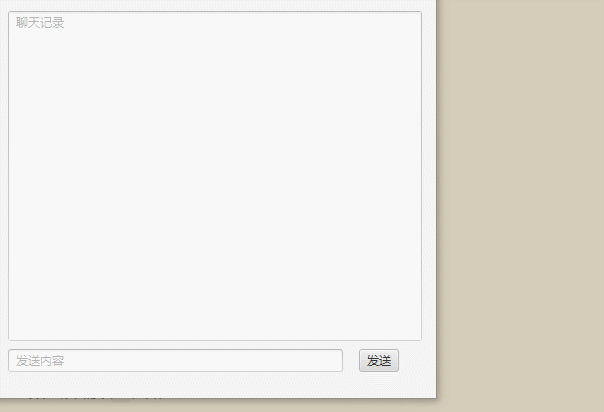
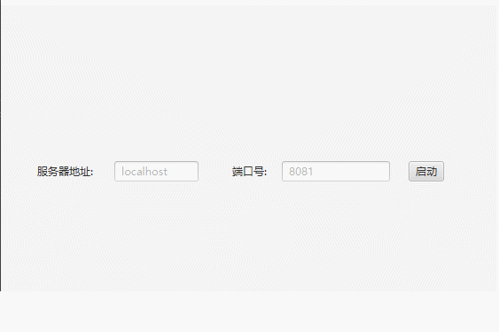

# chat
搭建一个聊天的服务器

# problem
修正在javafx->TextFile中输入发送信息后直接处理textArea域,会因为发送到服务器这段延迟致使textArea域一直是上一次发送的数据;




在MainApp中增加回调  `client.setRootLayoutCallBack(rootLayoutController);`

(```)
  public void callBack(){
        chatHisId.setText(RedisProxy.get(ConfigConstant.chat_return_msg.getValue()));
    }
(```)
修复后:

,如果项目启动报错: no location set   ;将   `loader.setLocation(Main.class.getResource("chat/view/root.fxml"));`改成
`loader.setLocation(this.getClass().getClassLoader().getResource(target目录下找到文件位置));`并在target目录下找到文件位置